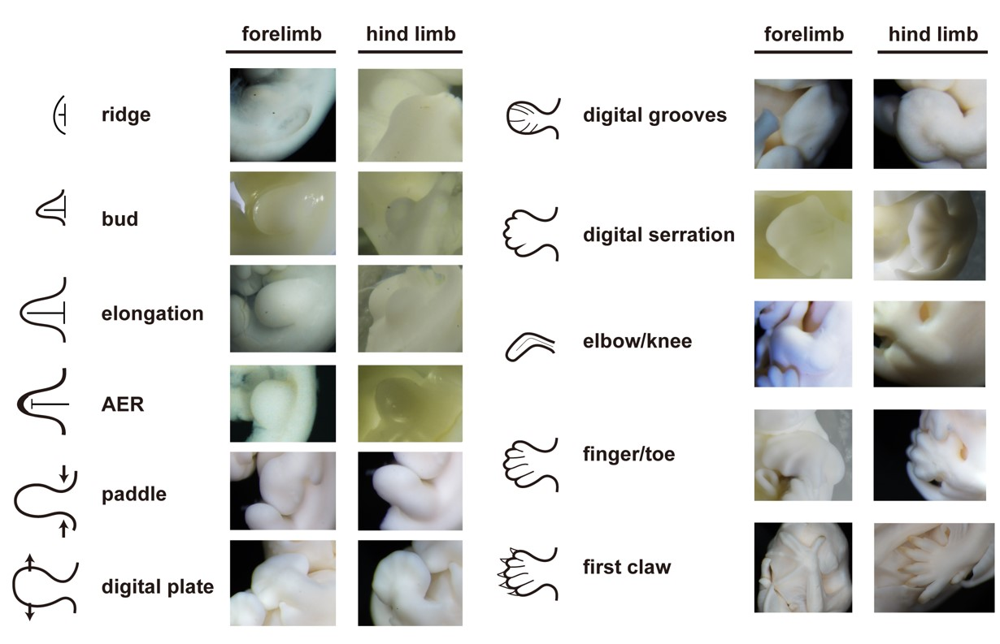
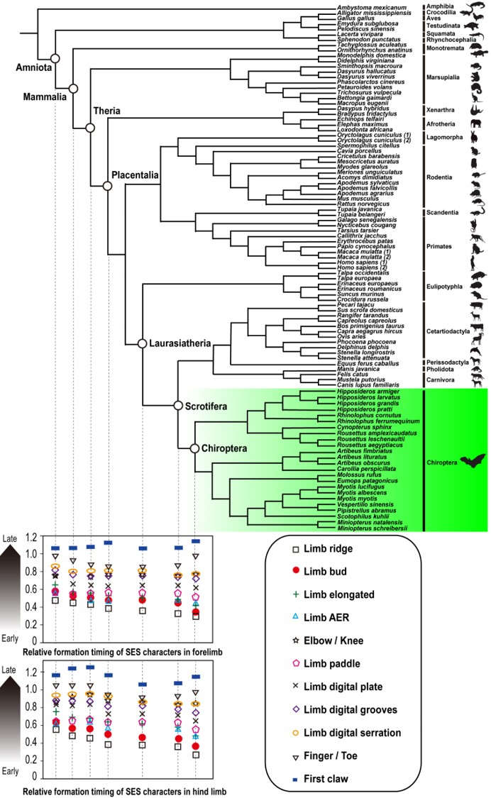
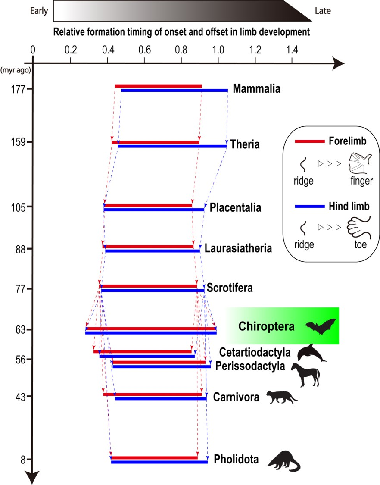
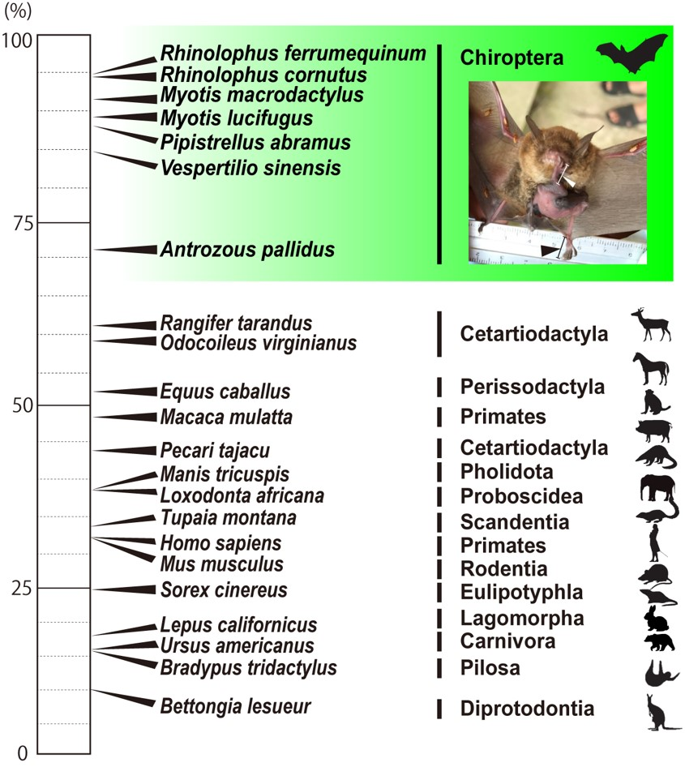

コウモリは自由飛行能力を獲得した唯一の哺乳類だ。空への進出に伴い、彼らは第2-5指の伸長や皮膜 (指間膜)の獲得を果たすなど, 前肢に大規模な形態学的変化を果たした。こうした理由から、これまでの研究者の注目は前肢に集中していた。コウモリの四肢形成の研究では、伸長した指骨や皮膜の形成に係る遺伝子発現の分析が主として行われてきた。しかしこれらの発生学研究ではマウスとコウモリの間での２種間比較にとどまっており、系統樹ベースでの解析が行われていないため、コウモリのパターンがどう派生的なのか？が評価されてこなかった。そこで本研究では、コウモリらしい四肢の形態は他の哺乳類と比べてどういった発生の時間的変化を介して形成されるのか、コウモリ24種・他羊膜類72種の胚発生から大規模解析を行った。
 
 
四肢形成は11個の発生学的ステージから定義される (図1)。 

図1. 四肢形成の発生ステージ

 

これら11個の発生学的形質が羊膜類に共通の120形質における相対形成タイミングを算出し、系統樹上にマッピングすることで各系統のノードにおける祖先型復元を行い、進化に伴う発生の時間的変化 (=ヘテロクロニー)を定量化した (図2)。

図2. ヘテロクロニー解析
 
 

哺乳類、獣類、有胎盤類、ローラシア獣類、Scrotifera (翼手類、鯨偶蹄類、奇蹄類、食肉類、センザンコウ類）、翼手類の祖先型復元値を比較したところ、前肢・後肢共に始点 (四肢頂堤: limb ridge)が翼手類で早期化, 終点 (指分化: finger/toe)が晩期化していることが判明した (図3)。したがって翼手類の進化に伴い、四肢形成が長期化していることが明らかとなった。

図3. 祖先型復元結果
 
 

前述のように、翼手類の前肢は皮膜や指骨の伸長といった形態学的刷新を成し遂げた。本研究で明らかとなった前肢形成の長期化は肥大化した前肢の形態形成のための期間を確保した結果と解釈できる。では後肢形成の長期化はどういう意味をもつのだろうか？

我々はコウモリの後肢の生後成長にヒントが隠されていると狙いを定め、成体に対する新生子の後足のサイズ比を測定した。結果、一般的な哺乳類は、前肢と後肢共に成体の半分以下のサイズで生まれてくるが、コウモリでは既に70%以上、特に発達した種では90%もの大きな足でもって誕生することが明らかとなった (図4)。

図4. 成体に対する新生子の後足のサイズ比
 
 
コウモリは出生直後に洞穴や母親に発達した後肢でしがみつくことが知られており、後足の優先的な発達がこうした新生子特有の生態とリンクしていることが示唆された。

他哺乳類へ目を向けると、例えば<a href="https://www.youtube.com/watch?v=UpsnREY-6no">カンガルー</a>は出生後発達した前肢を利用して母体の育児嚢へとよじ登ることで知られる (下記動画参照)。

<iframe width="560" height="315" src="https://www.youtube.com/embed/UpsnREY-6no" title="YouTube video player" frameborder="0" allow="accelerometer; autoplay; clipboard-write; encrypted-media; gyroscope; picture-in-picture" allowfullscreen></iframe>

本研究で明らかとなったコウモリの優先的な後肢発生は、カンガルーとは対照的な例であるといえる。
 
 
今後はコウモリ内における種間変異や四肢形成の時間的変化をもたらす遺伝子発現の分析を含めて解析を行う予定である。

See you in next paper!

